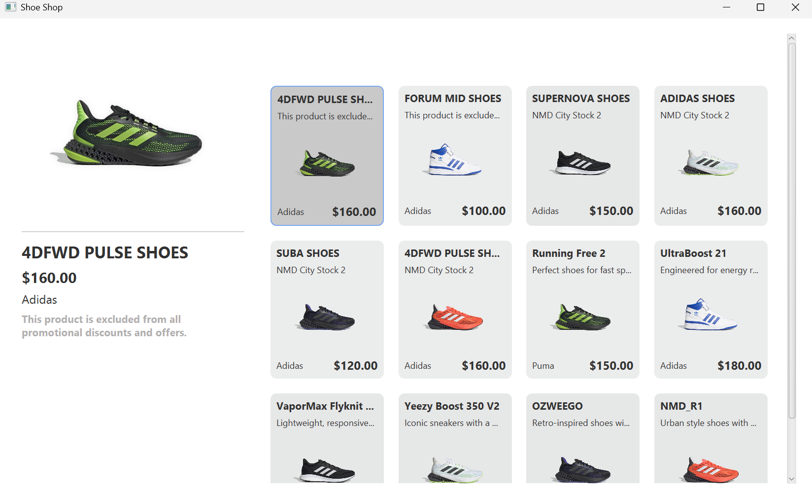

# LAB03

Lab03 môn IE303 - Công nghệ Java.

## 📁 Cấu trúc thư mục
LAB03/
├── src/ # Mã nguồn chính
│ └── main/
│ ├── java/
│ │ └── com/
│ │ └── example/ # Thư mục chứa mã nguồn Java
│ │ ├── Main.java # Lớp chính (Entry point của ứng dụng)
│ │ ├── PData.java # Lớp chứa dữ liệu sản phẩm
│ │ └── Product.java # Lớp mô tả đối tượng sản phẩm
│ └── resources/ # Tài nguyên hình ảnh
│ ├── img1.png
│ ├── img2.png
│ ├── img3.png
│ ├── img4.png
│ ├── img5.png
│ └── img6.png
├── target/ # Thư mục chứa các file biên dịch (tự sinh ra khi build)
├── .gitignore # Các file và thư mục không được quản lý bởi Git
├── pom.xml # File cấu hình Maven
└── README.md # Tệp hướng dẫn sử dụng dự án

## Cách chạy dự án bằng Maven trên VS Code
1. Đảm bảo rằng bạn đã cài đặt Maven trên máy tính của mình. Bạn có thể kiểm tra bằng cách chạy lệnh sau:
```bash
mvn -v
```

2. Tải dự án về và mở thư mục chứa dự án trong terminal hoặc command prompt.
```bash
   git clone https://github.com/vydo4243/IE303-Lab03.git
```

3. Chạy lệnh dưới đây để biên dịch và chạy ứng dụng:
```bash
mvn clean install
mvn javafx:run
```

## 🖼️ Giao diện ứng dụng
